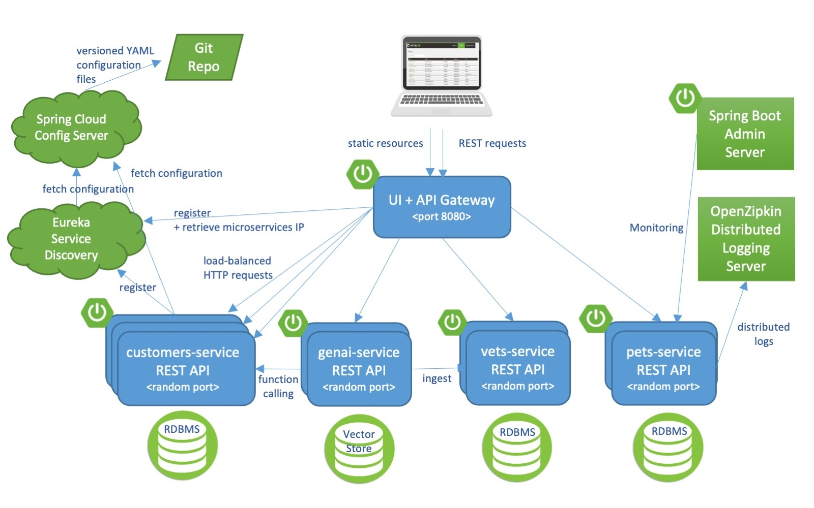

# Phiên bản phân tán của ứng dụng mẫu Spring PetClinic được xây dựng với Spring Cloud và Spring AI [](https://github.com/spring-petclinic/spring-petclinic-microservices/actions/workflows/maven-build.yml) [](https://opensource.org/licenses/Apache-2.0)

Nhánh microservices này ban đầu được phát triển từ [phiên bản AngularJS](https://github.com/spring-petclinic/spring-petclinic-angular1) để minh họa cách chia ứng dụng Spring mẫu thành các [microservices](http://www.martinfowler.com/articles/microservices.html). Để đạt được mục tiêu đó, chúng tôi sử dụng Spring Cloud Gateway, Spring Cloud Circuit Breaker, Spring Cloud Config, Micrometer Tracing, Resilience4j, Open Telemetry và Eureka Service Discovery từ ngăn xếp công nghệ [Spring Cloud Netflix](https://github.com/spring-cloud/spring-cloud-netflix).

[](https://codespaces.new/spring-petclinic/spring-petclinic-microservices)
[](https://app.codeanywhere.com/#https://github.com/spring-petclinic/spring-petclinic-microservices)

## Khởi chạy các dịch vụ cục bộ không cần Docker

Mỗi microservice là một ứng dụng Spring Boot và có thể được khởi chạy cục bộ bằng IDE hoặc lệnh `../mvnw spring-boot:run`. Lưu ý rằng các dịch vụ hỗ trợ (Config và Discovery Server) phải được khởi chạy trước bất kỳ ứng dụng nào khác (Customers, Vets, Visits và API). Việc khởi động Tracing server, Admin server, Grafana và Prometheus là tùy chọn.

Nếu mọi thứ diễn ra thuận lợi, bạn có thể truy cập các dịch vụ sau tại các địa chỉ đã cho:

* Discovery Server - http://localhost:8761
* Config Server - http://localhost:8888
* Giao diện AngularJS (API Gateway) - http://localhost:8080
* Customers, Vets, Visits và GenAI Services - cổng ngẫu nhiên, kiểm tra Eureka Dashboard
* Tracing Server (Zipkin) - http://localhost:9411/zipkin/ (chúng tôi sử dụng [openzipkin](https://github.com/openzipkin/zipkin/tree/main/zipkin-server))
* Admin Server (Spring Boot Admin) - http://localhost:9090
* Grafana Dashboards - http://localhost:3000
* Prometheus - http://localhost:9091

Bạn có thể yêu cầu Config Server sử dụng kho Git cục bộ của mình bằng cách sử dụng native Spring profile và thiết lập biến môi trường GIT_REPO, ví dụ:
`-Dspring.profiles.active=native -DGIT_REPO=/projects/spring-petclinic-microservices-config`

## Khởi chạy các dịch vụ cục bộ với docker-compose

Để khởi chạy toàn bộ hạ tầng bằng Docker, bạn phải xây dựng các image bằng cách thực thi:
```bash
./mvnw clean install -P buildDocker
```

Điều này yêu cầu Docker hoặc Docker desktop phải được cài đặt và đang chạy. Thay vào đó, bạn cũng có thể xây dựng tất cả các image trên Podman, yêu cầu Podman hoặc Podman Desktop phải được cài đặt và đang chạy.

```bash
./mvnw clean install -PbuildDocker -Dcontainer.executable=podman
```

Theo mặc định, Docker OCI image được xây dựng cho nền tảng linux/amd64. Đối với các kiến trúc khác, bạn có thể thay đổi bằng cách sử dụng tham số dòng lệnh maven `-Dcontainer.platform`. Ví dụ, nếu bạn nhắm đến các container image cho Apple M2, bạn có thể sử dụng dòng lệnh với kiến trúc linux/arm64:

```bash
./mvnw clean install -P buildDocker -Dcontainer.platform="linux/arm64"
```

Khi các image đã sẵn sàng, bạn có thể khởi chạy chúng bằng một lệnh duy nhất `docker compose up` hoặc `podman-compose up`.

Thứ tự khởi động container được điều phối với điều kiện `service_healthy` của biểu thức [depends-on](https://github.com/compose-spec/compose-spec/blob/main/spec.md#depends_on) của Docker Compose và [healthcheck](https://github.com/compose-spec/compose-spec/blob/main/spec.md#healthcheck) của các container dịch vụ.

Sau khi khởi động các dịch vụ, phải mất một lúc để API Gateway đồng bộ với service registry, vì vậy đừng lo lắng về các timeout ban đầu của Spring Cloud Gateway. Bạn có thể theo dõi tính khả dụng của các dịch vụ bằng Eureka dashboard có sẵn mặc định tại http://localhost:8761.

Nhánh chính sử dụng Eclipse Temurin với Java 17 làm Docker base image.

*LƯU Ý: Trên MacOSX hoặc Windows, hãy đảm bảo rằng Docker VM có đủ bộ nhớ để chạy các microservices. Các cài đặt mặc định thường không đủ và làm cho docker-compose up chạy cực chậm.*

## Khởi chạy các dịch vụ cục bộ với docker-compose và Java

Nếu bạn gặp vấn đề khi chạy hệ thống qua docker-compose, bạn có thể thử chạy script `./scripts/run_all.sh` sẽ khởi động các dịch vụ hạ tầng qua docker-compose và tất cả các ứng dụng Java qua lệnh `nohup java -jar ...` tiêu chuẩn.

Các log sẽ có sẵn dưới `${ROOT}/target/nameoftheapp.log`. Mỗi ứng dụng Java được khởi động với profile chaos-monkey để tương tác với Spring Boot Chaos Monkey. Bạn có thể xem (README)[scripts/chaos/README.md] để biết thêm thông tin về cách sử dụng script hỗ trợ `./scripts/chaos/call_chaos.sh` để kích hoạt các cuộc tấn công.

## Hiểu về ứng dụng Spring Petclinic

[Xem bài thuyết trình về phiên bản Spring Petclinic Framework](http://fr.slideshare.net/AntoineRey/spring-framework-petclinic-sample-application)

[Một bài blog giới thiệu Spring Petclinic Microsevices](http://javaetmoi.com/2018/10/architecture-microservices-avec-spring-cloud/) (tiếng Pháp)

Sau đó bạn có thể truy cập petclinic tại đây: http://localhost:8080/

## Tổng quan về Microservices

Dự án này bao gồm nhiều microservices:

- **Customers Service**: Quản lý dữ liệu khách hàng.
- **Vets Service**: Xử lý thông tin về bác sĩ thú y.
- **Visits Service**: Quản lý hồ sơ thăm khám thú cưng.
- **GenAI Service**: Cung cấp giao diện chatbot cho ứng dụng.
- **API Gateway**: Định tuyến yêu cầu từ client đến các dịch vụ phù hợp.
- **Config Server**: Quản lý cấu hình tập trung cho tất cả các dịch vụ.
- **Discovery Server**: Registry dịch vụ dựa trên Eureka.

Mỗi dịch vụ có vai trò cụ thể riêng và giao tiếp qua REST APIs.


**Sơ đồ kiến trúc của Spring Petclinic Microservices**



## Tự động hóa việc Build và Push Docker Images

Dự án cung cấp hai script tự động để build và push Docker images lên Docker Hub:

### Script cho Linux/macOS (build-and-push.sh)

```bash
chmod +x build-and-push.sh
./build-and-push.sh
```

### Script cho Windows PowerShell (build-and-push.ps1)

```powershell
./build-and-push.ps1
```

### Chức năng của các script:

**Bước 1: Build Docker Images**
- Thực hiện lệnh `./mvnw clean install -P buildDocker -DskipTests` để build tất cả các Docker images
- Bỏ qua việc chạy tests để tăng tốc quá trình build

**Bước 2: Tag và Push Images**
Script sẽ tự động xử lý các microservices sau:
- `customers-service`
- `vets-service` 
- `visits-service`
- `api-gateway`
- `config-server`
- `discovery-server`
- `admin-server`

Với mỗi service, script sẽ:
1. Kiểm tra xem Docker image đã được build thành công chưa
2. Tag image từ format cục bộ (`springcommunity/spring-petclinic-[service]:latest`) sang format Docker Hub (`nghiax1609/spring-petclinic-[service]:latest`)
3. Push image lên Docker Hub

### Yêu cầu trước khi chạy:
- Đã cài đặt Docker và đang chạy
- Đã đăng nhập vào Docker Hub: `docker login`
- Có quyền push lên repository đích (hoặc thay đổi `DOCKER_USER` trong script)

**Lưu ý:** Bạn cần chỉnh sửa biến `DOCKER_USER` trong script để trỏ đến Docker Hub username của bạn trước khi chạy.